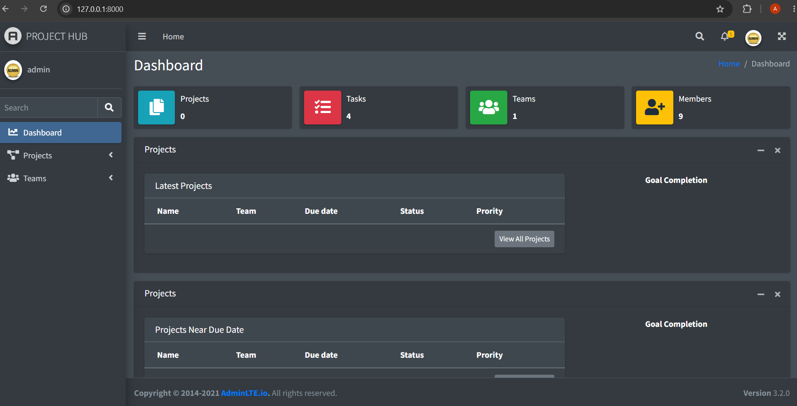
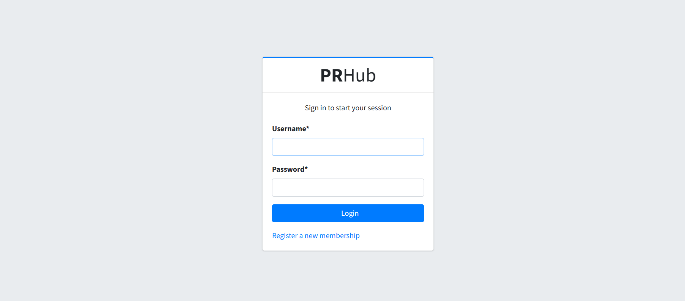

# Project Management System

## Description
A Python application to manage projects with CRUD operations.

## Features
- This system enables developers to collaborate effectively on their projects and lead their teams.
- It allows us to monitor our budgets and track project expenses.
- Leaders can assign tasks to team members, facilitating communication and the sharing of attachments or files.
- The system is developed using the Django framework and MySQL as the database server.


## Technologies Used
- Python
- SQLite
- HTML5
- CSS3
- Javascript

# Screenshots

## Home Page


## Login Page


## Installation

Clone the repository:

```bash
git clone https://github.com/ajayakumar4741/project-management-system.git